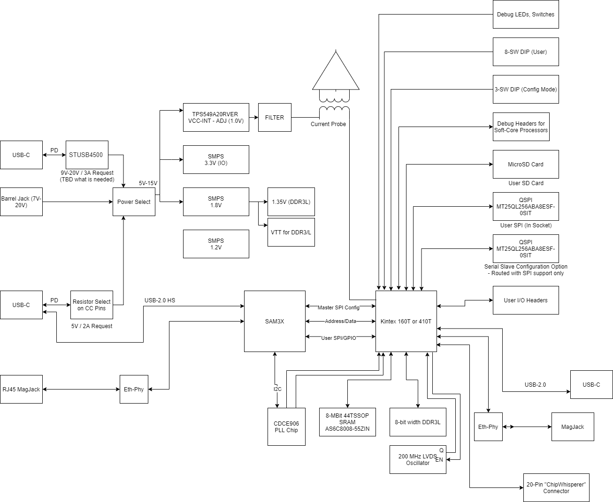

# CW310 Bergen Board (Kintex FPGA Target)

## Block Diagram & Overview

## Power Supplies & Monitoring

The CW310 includes the following power supplies:

* 8-20V input --> 5V output
* 5V --> 1V VCC-INT (10A)
* 5V --> 1.8V Aux
* 5V --> 3.3V I/O voltage
* 5V --> 1.2V spare

The normal operating mode of the board is to use a higher voltage input, supplied from a USB-C wall adapter or DC barrel jack, which generates the main 5V supply for the board. This configuration is set by switch SW2 as shown here:

As an alternative, you can also take the 5V supply from the "control" USB-C controller. This is normally not recommended, as the current requirement can exceed what a typical computer/laptop is willing to supply out of it's USB-C port (and even worse if you use the USB-A to USB-C adapter).

You can toggle the target portion of the power supplies off using switch S1, labelled "Tgt Power" on the PCB:

When set to "off", the power supplies on the FPGA side will be turned off, and signals driving the FPGA will be disabled. When set to "auto", the target power is controlled by the API (default is "on", but the user can now toggle it). This switch can be used to quickly turn the target power off without closing the USB computer connection, or to quickly toggle the target power to clear any corrupt configuration data.

The USB control power can be toggled on and off with switch XX, near the USB-C data connector. This allows you to effectively turn off the entire board. Note the "USB-C PD" status LEDs may still stay on here, as there is still power applied via that connector (but disabled to the rest of the board).

### Power Good Monitoring

The power good outputs are monitored by the microcontroller. If they cycle several times (indicating the device is struggling to maintain power), the device goes into fail-safe mode which shuts off the target power. This will often occur if your source power supply is insufficient, but could also indicate a short (such as an accessory board is shorting out). The failure will be indicated by the "Surge" LED coming on:

If this happens, double-check the setting of the 5V source switch - be sure you are using the on-board 5V regulator instead of just taking power from the control USB-C port. You can restart the regulators with the "Restart Power" button once you have rectified any latent faults.

This button will also be used to recover from thermal faults.

NOTE: These faults can also be cleared via the Python API, allowing fully remote usage.

### USB-C PD Profiles

If using the USB-C power-only port, the board will attempt to request one of these power profiles:

* TODO

## Thermal

The CW310 integrates a FPGA thermal monitor, and turns on fans as required. If the temperature gets too high, it also kills power to target side to protect the FPGA from cooking itself.

### Fans

Due to the access required to the FPGA top-side when performing certain security evaluation work, the CW310 can be physically set up to use one of four fans (all four are driven from the same signal):

* Top-side cross-flow fan (for heatsink or exposed die backside work).
* Top-side heatsink mounted fan.
* Bottom-side cross-flow fan (best with heatsink).
* Bottom-side heatsink mounted fan.

TODO - fan header

### Heatsink

The board is designed to work with XXXX TODO.

### Thermal Monitoring

The two LEDs indicate the thermal status:

1. Green = temperature is below 55C.
2. Red solid = temperature is 55C to 70C.
3. Red blinking = temperature is above 70C.

Once the temperature is above 75C the power is immediately cut to the target device. The die temperature is still reflected in the LED state, but you will need to press the `Restart Power` button to bring the target power back (also can be done via a API call). If the target device temperature is above 70C, the power will not be turned onto the device.

You can read the FPGA temperature from the Python API as well.

## Configuration Options

The mode switches on the bottom of the board allow you to set the M0/M1/M2 pins. Note that the microcontroller can override the DIP switch settings - this is done to make it easier to work with the board, as most normal usage of the board will automatically set the mode switches.

If you use the Python API to configure the device, it will automatically override the mode switches to what Xilinx calls "slave serial" mode (referred to as "controller driven" for clarity here) for example. This serial mode is the *default and supported configuration mode* for most users.

### Controller Driven Serial Configuration

The default mode of loading a bitstream into the board is over the USB interface, which happens with the Python API. This allows simple integration of your target into a larger test environment without relying on additional connections.

This configuration is moderately fast - the current firmware loads an uncompressed K160T bitstream in XX seconds, and an uncompressed K410T bitstream in XX seconds. The bitstream compression feature can be enabled which results in significant loading time improvements, especially for small designs. 

TODO TEST

### Configuration Failure Detection

Two methods are used to detect configuration failure. The most basic is the `DONE` pin, which goes high when the device is configured successfully. When the `DONE` pin goes high LED `D6` will also *turn off*.

The `INITB` signal is also routed to LED D10, in addition to being monitored by the controller. You can configure the FPGA to perform an automatic "continuous CRC" function which will flag configuration errors as they occur. If using the board for fault injection this is **mandatory**. You can monitor the status of the INITB flag via the Python API.

### Configuration Signal Breakout

### Xilinx JTAG Configuration & Debug

A standard 14-pin Xilinx JTAG header is provided, which also allows usage of debug tools such as ILA cores via a Xilinx Platform USB Cable (not included). Note you can still configure the FPGA via the USB interface even if using the JTAG header for debug access.

## Power Analysis Options

## USB Interface (via SAM3X)

The CW310 integrates a SAM3X microcontroller that provides the host USB interface. This microcontroller is preloaded with firmware that provides features such as:

* High-speed USB interface to computer.
* Management of power, PLL, and thermal monitoring chips.
* Simple address/data bus to read/write data into FPGA.
* FPGA configuration.

The firmware written to the SAM3X is open source and can be modified for your own use. This microcontroller can also be used to perform ultra high speed captures, by offloading the test vector generation onto the microcontroller itself.

For more information on the USB/SAM3X microcontroller, see the `microfw` directory.

### USB Serial Ports

The SAM3X exposes two USB-CDC serial ports with the default firmware. On plugging the USB-C data connector in, you should see two USB serial ports on your host. These ports are connected on the FPGA as follows, where the direction is relative to the FPGA (i.e. - the keywork you would use in your top module):

| Name | FPGA Pin | FPGA Direction |
| ---- | -------- | -------------- |
| RXD0 | P26      | `output`       |
| TXD0 | P25      | `input`        |
| RXD1 | P24      | `output`       |
| TXD1 | P23      | `input`        |

These  act as normal serial ports, with a configurable baud rate from the host computer. Note that as these are implemented in the SAM3X you can modify them to route the serial data to another location instead of USB, or perform any filtering or processing you require. The default operation mode is a standard serial port (similar to a FTDI chip or similar).

### Ethernet MAC/PHY

The SAM3X includes a 10/100 Ethernet MAC & PHY. This is currently unused with the default firmware, but you can use this to provide the same features as the USB interface but over Ethernet (helpful for using many target boards).

## User QSPI & MicroSD Card

A user QSPI socket is present, tested with Micron `MT25QL256ABA1EW9-0SIT`. This is designed to fit standard 6x8 WSON package QSPI chips. The expected pinout of the chip is as follows:

The connection between QSPI and FPGA is given below:

| QSPI Pin | QSPI (SPI) Name | FPGA Pin |
| -------- | --------- | -------- |
| 1        | CS#       | AF23
| 2        | DQ1 (DOUT) | AE22
| 3        | DQ2 (WP#) | AF22
| 4        | GND       | GND
| 5        | DQ0 (DIN) | AB21
| 6        | CLK       | AE25
| 7        | DQ3 (HOLD# or RESET#)       | AC22
| 8        | VDD       | 3.3V/1.8V from S4

In addition, a MicroSD card is also present for user use. The MicroSD card has the following pinout for the FPGA:

| Micro SD Pin | Micro SD Name | FPGA Pin |
| -------- | --------- | -------- |
| 1        | DAT2      | AC21
| 2        | CD/DAT3   | AD21
| 3        | CMD       | AE21
| 4        | VDD       | 3.3V/1.8V from S4
| 5        | CLK       | AD23
| 6        | GND       | GND
| 7        | DAT0      | AE23
| 8        | DAT1      | AF24
| --       | Card Detect | AF25

Both of these devices connect to the same FPGA bank, which has a voltage level set with Switch S4. The voltage level for this bank also routes to the MicroSD and QSPI VCC pin - confirm the expected voltage before using these peripherals!

## User Expansion Headers A / B

Two expansion headers are provided, which use standard 0.05" (1.27mm) pitch headers. These allow mating of either daughter boards or cables as required.

Each header can be set to a separate I/O level, as each header routes to a different FPGA bank. 

## User PMOD Headers

Two PMOD headers are provided on the board. These provide 16 digital I/O signals (8 per header) along with 3.3V and GND pins. The I/O level for these headers is always 3.3V.

## User JTAG Headers

For soft-core implementations, several standard JTAG headers are provided on the board. Three standard headers are provided which reflect:

* 20-pin 0.1" JTAG (Arm Standard)
* 10-pin 0.05" JTAG/SWD (Arm Cortex-M)
* 20-pin 0.05" Trace/SWD (Arm Cortex-M)

Each of these includes a VCC pin. Switch XXX sets if the VCC pin is driven from the board with 3.3V (XXXX setting), or if it connects via a resistor to FPGA pin XXXXX to use for sensing purposes. Normally if you are implementing a soft-core & using the debug header, your debugger will require you to drive the VCC pin with 3.3V for detection.

## User USB

An additional USB-C connector is provided that allows you to route a user USB signal.

## SRAM

## DDR3